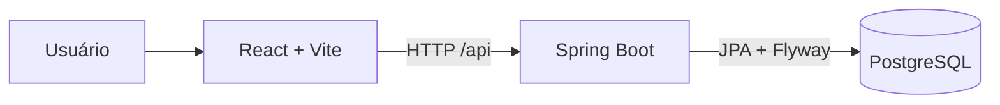

# Arquitetura

LimpaCity começa como um monorepo simples. O frontend apresenta a experiência web; o backend concentra a API e a persistência; PostgreSQL mantém os dados. Não há regras de negócio ou domínio definidos nesta etapa.

## Diretórios

- `front/`: código React, estilos Tailwind e serviços HTTP.
- `back/`: API Java, configurações, controllers e migrations.
- `docs/`: decisões e procedimentos de engenharia.

O frontend lê `VITE_API_URL`; a API lê credenciais do banco por variáveis de ambiente. CORS aceita apenas a origem local configurada. Em produção, `CORS_ALLOWED_ORIGIN` deve ser definido para o domínio público da interface, nunca para `*`.
